# 闪词 3.0 完整 User Flow

> 2026-09-07：新重写已经完成，现行行为合同与验收结果统一见 [执行计划](flashvocab-3-rewrite-plan.md)。下文保留旧流程作为历史来源，不再代表当前产品流程。

> 状态：历史逻辑来源；3.0 重写已完成
> 日期：2026-08-30  
> 范围：用户从打开网页、准备词表、辨识、拼写、返场、完成到再次打开的完整流程  
> 不包含：界面布局、视觉风格、动效参数、代码实现与算法字段

## 结论

闪词 3.0 的主流程不是“刷完一轮后让用户选择做什么”，而是：

**准备或恢复词表 → 辨识 → 系统解释并安排下一步 → 只让具备基础的词进入拼写 → 延后复习或回到辨识 → 明确完成。**

用户持续提供极轻量的学习证据，系统负责整理词序、判断阶段、安排返场、保存进度和解释空状态。正常学习时，用户不需要理解内部轮数、隐藏状态或调度规则。

## 一、阅读规则

### 状态标签

- **已对齐**：已经由产品初心和 3.0 设计底稿推出，可作为后续设计约束。
- **已确认**：产品负责人已经选择，可进入后续低保真设计；标为“实验性”的规则仍需在真实作业中验证。
- **推荐**：当前建议采用的 v0.1 默认方案，需要通过低保真稿和实际使用验证。
- **待确认**：会明显改变 User Flow，进入界面设计前需要由产品负责人拍板。

### 流程图语义

- 圆角节点：一个稳定状态或结果；
- 菱形节点：系统或用户必须作出的判断；
- 主路径：系统推荐的默认前进方向；
- 次级路径：用户主动改选、打开帮助或管理工具；
- 后台策略不会伪装成用户步骤，只在图后单独说明。

## 二、从初心到 User Flow

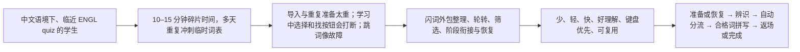

每一个环节都要能回答四个问题：

1. 是否让用户更快开始本次学习；
2. 是否减少学习中的判断和操作；
3. 是否直接服务于 quiz 所需的辨识与拼写；
4. 是否让中断和下次继续更容易。

## 三、总体 User Flow

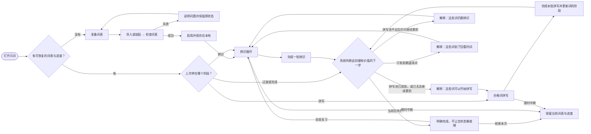

### 总流程的三条硬约束

1. 正常推进只有一个主动作；次级改选存在，但不与主动作争夺注意力。
2. 系统改变阶段前，必须用一句人话说明“为什么”和“接下来会发生什么”。
3. “继续辨识”“可以拼写”“之后再复习”“从词表移除”是四种不同状态，不能混用文案。

## 四、打开、准备与恢复

### 4.1 首次使用或没有词表

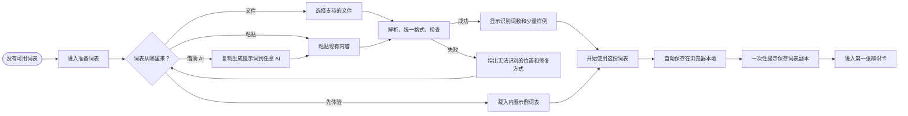

**已对齐：**文件、粘贴和 AI 生成只是三种输入入口，最终必须收敛到同一个“识别成功 → 立即开始 → 可保存副本”的状态。

**待确认 D1：**首次无词表时采用“直接进入内置词表”，还是“准备词表为主、内置示例为次”，暂不只凭文字决定。低保真阶段必须把两种首屏都画出来，以实际进入感受对比后再选择；在此之前，两条路径都保留，不把任何一条写成正式默认值。

### 4.2 已有词表再次打开

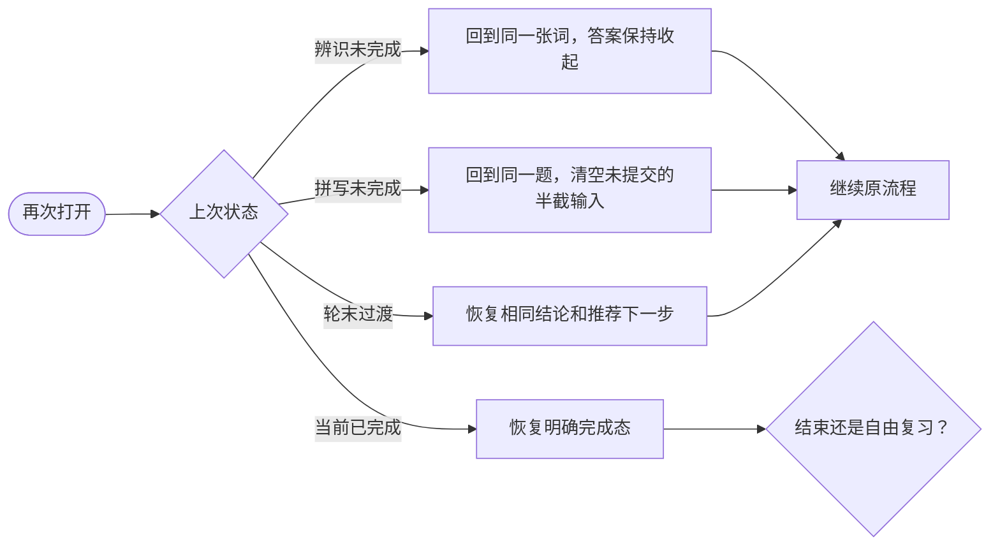

**已对齐：**打开应用首先是“继续”，不是重新选择模式；自动保存是后台能力，不成为额外步骤。

### 4.3 导入新词表替换当前词表

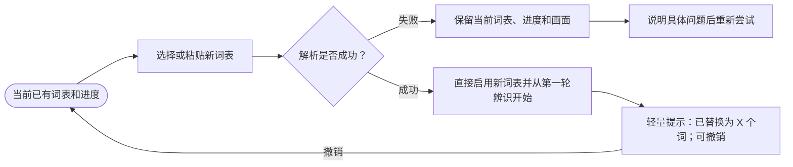

**已确认 D2：**新词表解析成功后直接替换，不增加事前确认步骤。可逆性改由替换后的轻量 Undo 承担：不打断导入，同时给误操作留下恢复路径。

## 五、单词辨识循环

### 5.1 每张词的主路径

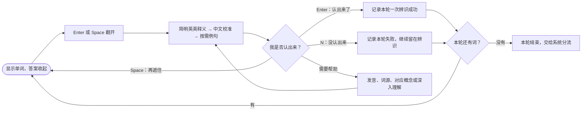

### 5.2 辨识证据的规则

- 翻开答案只代表“看到了”，不代表“认出来了”。
- 只有翻开后明确按 `Enter` 或 `N` 才产生一次学习证据。
- 同一个词在同一轮最多记录一次；返回上一张、再次翻开或反复查看不会重复加分。
- 辨识失败会让词继续留在辨识阶段，不把它送去拼写。

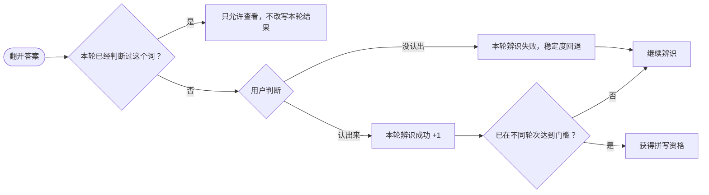

**已确认 D3（实验性）：**先采用“两个不同轮次辨识成功”作为拼写资格。等收到下一份真实作业后实测；如果进入拼写明显过慢，再退回一次正确即可获得资格。

### 5.3 辅助动作不改变主状态

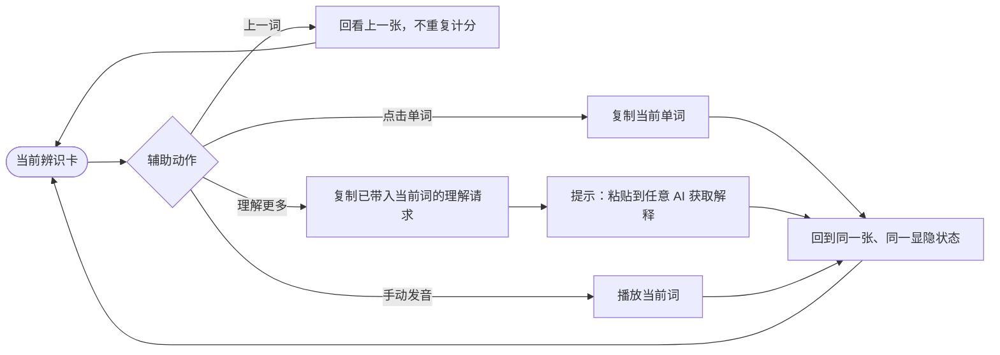

**已对齐：**深度理解是“当前词卡住后”的上下文支路，不再是与 Import、Export 同级的全局入口。

## 六、轮末自动分流

轮末是 2.5 最割裂的地方，也是 3.0 的核心重构点。系统先尝试把合格词积累成 3–5 个的小批次，再判断是否仍有不稳定词、是否存在不足 3 个但已经无法继续积累的尾批、是否有到期返场词；最后才进入完成。

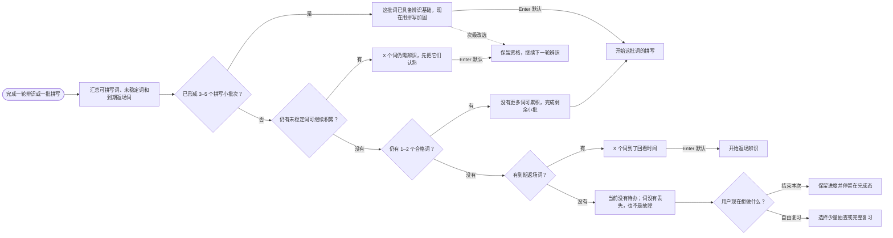

### 五个 Case 的人话版本

#### Case A：拼写候选已形成 3–5 个小批次

`完成辨识 → 3–5 个词达到门槛 → 说明“这批词现在适合拼写” → Enter 开始拼写 → 次级动作仍可继续辨识。`

#### Case B：已有 1–2 个候选，仍能继续积累

`完成辨识 → 拼写池不足 3 个 + 仍有未稳定词 → 保留已有资格 → 说明“再认熟一小批” → Enter 进入下一轮辨识。`

#### Case C：只剩 1–2 个候选，已经无法继续积累

`完成辨识 → 拼写池不足 3 个 + 没有其他未稳定词 → 为避免卡住，放行剩余小批 → Enter 开始拼写。`

#### Case D：没有普通词，但有到期返场词

`完成一轮 → X 个词到了回看时间 → 说明这是返场而不是词表重置 → Enter 开始返场辨识。`

#### Case E：所有词都在等待，当前没有到期词

`完成一轮 → 0 个普通词 + 0 个拼写候选 + 0 个到期词 → 完成页明确说明原因 → 用户结束，或主动自由复习。`

**已对齐：**系统自动给出默认路线，用户保留一个不显眼的改选入口。改选后不清除已经获得的拼写资格。

**已确认 D4（实验性）：**不因 1 个候选立即切换阶段，先积累成 3–5 个的小批次。若已经没有其他未稳定词可供累积，则放行最后 1–2 个，避免流程永远停在辨识。真实作业中重点观察：批量感是否更自然，以及拼写验证是否被推迟过久。

**已确认 D5：**完成态的 `Enter` 表示结束本次，并停留在完成页；“自由抽查 / 完整复习”作为主动入口，不自动制造额外一轮。

## 七、合格词拼写

### 7.1 每张词的主路径

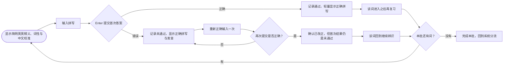

**已确认 D6：**首次拼错后必须正确重打一次才能前进，但改正不覆盖首次错误。这既完成了当下的拼写动作，也不污染系统对掌握程度的判断。

### 7.2 中断拼写

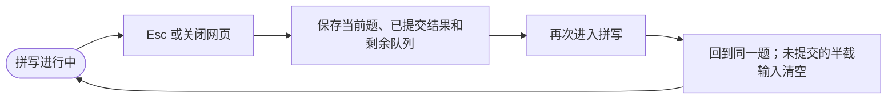

**已确认 D7：**中断代表暂停，不代表放弃这批拼写。保存当前题、已提交结果和剩余队列；恢复时回到同一题，并清空未提交的半截输入。

## 八、返场与词的生命周期

用户只需要理解三个学习阶段；“隐藏”“due round”“同步”等内部字段不进入日常界面。

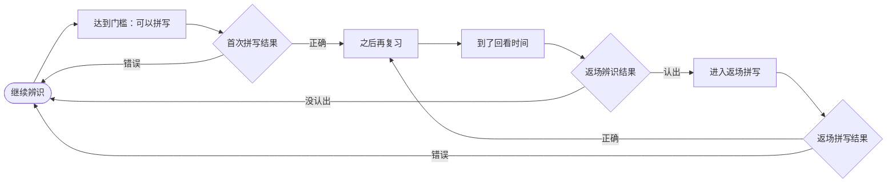

### 后台调度的可解释边界

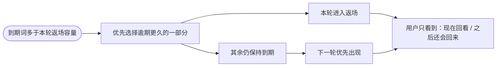

“之后再复习”绝不表示删除；暂时没有词出现时，完成页必须解释其原因。

## 九、移除、撤销、重置与更换

### 9.1 从当前词表移除

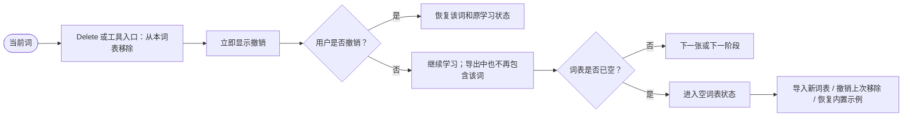

**已确认 D8：**移除即刻执行并提供清晰 Undo，不增加确认弹窗。动作必须叫“从本词表移除”，不能与系统的“之后再复习”混淆。

### 9.2 三种高影响操作

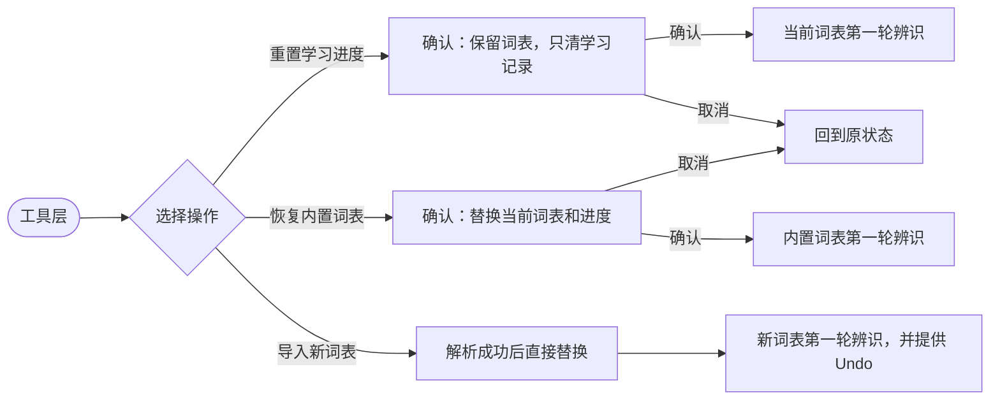

## 十、理解帮助、设置与静默模式

### 10.1 理解帮助

`当前词 → 用户卡住 → 按需打开发音、例句、词源、对应概念或深度理解 → 得到帮助或复制提示词 → 回到同一张、同一阶段。`

当前 3.0 的释义顺序：

`翻开 → 足够简单的英英释义 → 中文快速定位和校准 → 按需例句与理解层。`

未来图片实验：

`翻开 → 若该词有可靠核心画面，则先感知画面 → 简明英英释义 → 中文校准。`

若图片缺失、不可靠或词过于抽象：

`图片路径失败 → 自动回到英英释义优先 → 不阻断学习。`

图片是未来实验，不进入 3.0 初始版本的必经 User Flow。

### 10.2 工具层

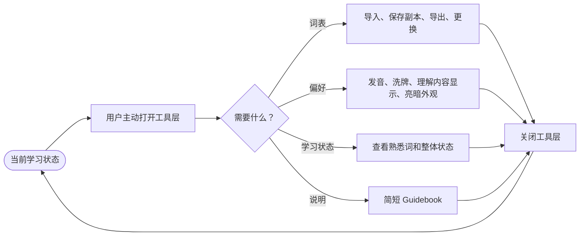

关闭工具层后回到原词、原阶段、原显隐状态；普通设置不重启一轮。

### 10.3 静默模式

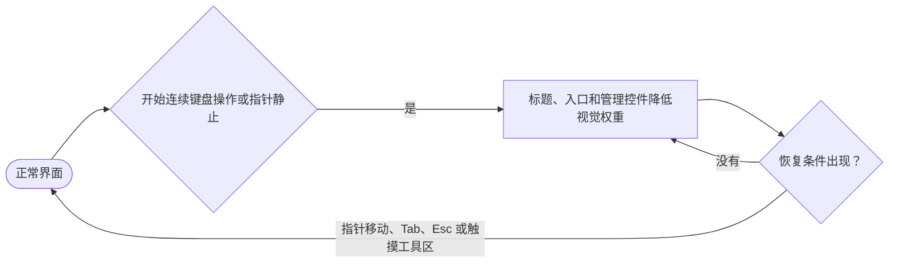

静默模式只改变注意力，不移动主卡，不让功能失去键盘可达性。

## 十一、异常、空状态与能力降级

| 触发状态 | 流程 | 稳定结果 |
| --- | --- | --- |
| 导入解析失败 | 选择内容 → 无法识别 → 指出具体问题 → 修正或换入口 | 当前词表与进度不变 |
| 导入后反悔 | 新词表解析成功并直接替换 → 点击 Undo | 恢复替换前的词表与学习进度 |
| 本地记录损坏 | 打开 → 无法安全恢复 → 说明记录不可用 → 准备词表或载入内置示例 | 应用仍可进入，不崩溃 |
| 发音不可用 | 请求发音 → 浏览器不支持 → 给出简短不可用说明 | 学习主链继续 |
| 剪贴板复制失败 | 复制单词或提示词 → 失败 → 显示可手动复制的内容 | 当前卡不变 |
| 所有词在等待返场 | 系统发现当前无普通词和到期词 → 明确完成页 | 不出现空白卡或顶部小字 |
| 到期词过多 | 只抽取本轮容量 → 其余继续保持到期 | 下一轮优先出现 |
| 移除最后一词 | 词表变空 → 空词表主状态 | 可撤销、导入或恢复示例 |
| 中断后重开 | 读取保存状态 → 恢复阶段 | 辨识答案收起；拼写半截输入清空 |

## 十二、完整状态清单

后续低保真稿至少需要覆盖以下 16 个状态，才算把 User Flow 画完整：

1. 无词表的准备页；
2. 导入解析失败；
3. 导入成功预览；
4. 新词表替换完成反馈与撤销；
5. 辨识未翻；
6. 辨识已翻；
7. 辨识已翻并打开理解层；
8. 轮末推荐继续辨识；
9. 轮末推荐开始拼写；
10. 轮末进入返场；
11. 当前无到期词的明确完成态；
12. 拼写输入；
13. 拼写正确；
14. 拼写错误并重打；
15. 工具层；
16. 空词表并可撤销。

## 十三、决策总表

| 编号 | 决策 | 已选路径 | 状态 |
| --- | --- | --- | --- |
| [D1](#decision-d1) | 没有用户词表时的首屏 | 等低保真 A/B 首屏出来后再决定 | 待确认 |
| [D2](#decision-d2) | 导入新词表 | 解析成功即替换，事后可 Undo | 已确认 A |
| [D3](#decision-d3) | 拼写资格 | 两个不同轮次辨识正确 | 已确认 B，实验性 |
| [D4](#decision-d4) | 拼写候选批量 | 积累成 3–5 个；尾批 1–2 个可放行 | 已确认 B，实验性 |
| [D5](#decision-d5) | 当前无待办时 `Enter` | 结束本次并停留完成态 | 已确认 A |
| [D6](#decision-d6) | 拼写首次错误 | 正确重打一次再前进 | 已确认 B |
| [D7](#decision-d7) | `Esc` 或关闭时 | 暂停并保存当前拼写批次 | 已确认 B |
| [D8](#decision-d8) | Remove | 立即移除并提供 Undo | 已确认 B |

D2–D8 已经成为后续低保真设计的逻辑基线；D3、D4 需等下一份真实作业进行验证。D1 必须先看到两种首屏的实际低保真效果再决定，不阻塞其他状态设计。

## 十四、逻辑验收标准

User Flow 对齐完成的标准不是流程图“看起来完整”，而是以下问题都能得到唯一、可解释的答案：

- 第一次打开、再次打开和中断恢复分别去哪；
- 文件、粘贴和 AI 生成的词表如何进入同一主循环；
- 翻开答案与“我认出来了”如何区分；
- 哪些词进入拼写，为什么进入；
- 拼写正确、错误和改正后分别去哪；
- 所有词暂时不出现时，用户看到什么、下一步是什么；
- 移除、暂缓、重置和替换有什么不同；
- 任意状态下按主动作会发生什么；
- 用户卡住、改变主意或被迫中断时如何回到主流程；
- 图片实验失败时，核心学习闭环仍能独立成立。

## 附录：来源与可编辑图

- [闪词 3.0 重构设计底稿](flashvocab-3-design-brief.md)
- [产品设计方法核心图](user-flow-sources/general-concept-graph.png)
- [闪词产品逻辑核心图](user-flow-sources/flashvocab2-logic.png)
- [可编辑 FigJam：闪词 3.0 完整 User Flow](https://www.figma.com/board/opENWBAXDlHYoPrVyzZQMM)

FigJam 内包含此前的总体流程与五张分图；本轮批注只更新文字逻辑，FigJam 暂未同步。Markdown 文档是当前有效版本，D1 确认并进入下一轮图形设计时再统一更新流程图。
